# Understanding Neural Nets

## Short Intro for Neural nets:

* Neural net can be seen like this
  * Given a input in d1 Dimensions.
  * During forward prop we do a matrix multiplication with a weights matrix .So here matrix multiplication helps in projecting our data in d1 Dimensional space to h1(Number of nodes/units in hidden layer) Dimensional space such that we are able to extract some information about data.
  * Matrix multiplication can do 
    * Rotation
    * Stretching
    * Reflection
    * steering
  * With help of bias we can even do translation.
  * Non-Linearities helps in twisting/curving .Without non-linearities we may can't get knowledge of complex data.
  * So therefore we need to find a better transformation/set of transformations so that our data can be understood well.
  * In Back Prop we try to adjust parameters/transformations such that we try to get as much information as possible.

More understanding can be found in [Spacestretching.ipynb].

Here I want to experiment on Following issues:

* Projecting to small dimensions vs Large dimensions.
* In 2 Layer Network
  * Projecting to small dimension (Hidden Layer-1) and then Projecting to Large dimensions (Hidden layer-2).
    * Are we Losing Information in 1st Hidden Layer due to its small dimension?
  * Projecting to Medium dimension (Hidden Layer-1) and then Projecting to Medium dimensions (Hidden layer-2).
    * Relation between different Single  Hidden Layer Network and different sized 2 Layer Hidden Networks?
  * Projecting to Big dimension (Hidden Layer-1) and then Projecting to Small dimensions (Hidden layer-2).
    * Checking if information is lost as we moving to low dimensional space?
* Due to Random Initialization of weights we are ending with different accuracies.(I tried to choose avg accuracy).
* Getting Idea of Neural Architecture (From varies Online resources):
  * [Reference Links](https://machinelearningmastery.com/how-to-configure-the-number-of-layers-and-nodes-in-a-neural-network/)
* Finally making some hypothesis from accuracies obtained.


## Classification :

* Training_data: 
* With Number of Classes: 3

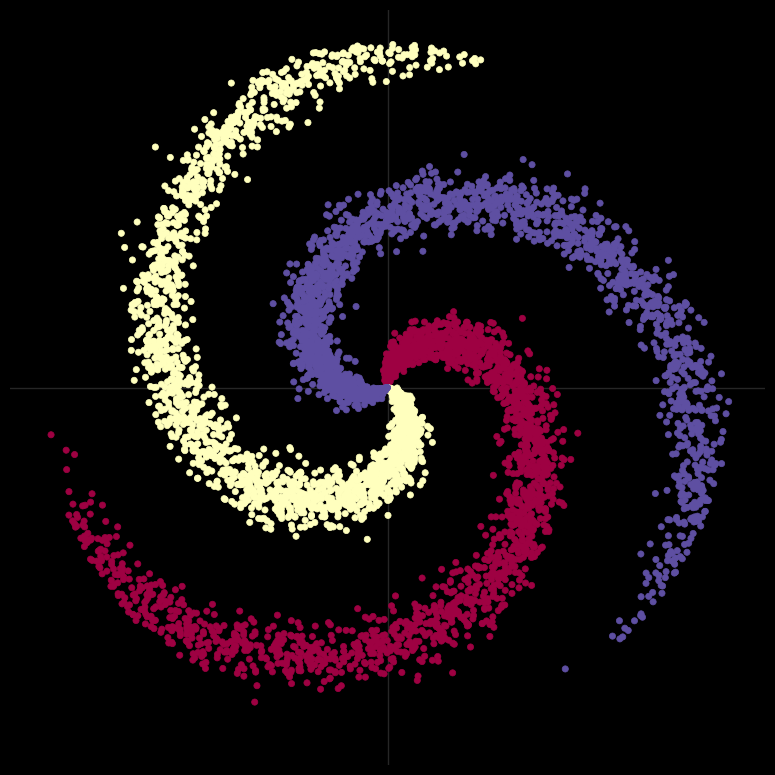


* Learning Rate: 1e-3

* lambda_l2: 1e-5

* Model:(with 2 layers):

  ````python
  model = nn.Sequential(
      nn.Linear(D, H),
      nn.ReLU(),
      nn.Linear(H, C)
  )
  ````

| S.No |   H   |  Accuracy  |  Loss   |
| :--: | :---: | :--------: | :-----: |
|  1   | C = 3 |  0.5-0.62  | ~0.7769 |
|  2   |  10   |  0.7-0.81  | ~0.3825 |
|  3   |  50   | 0.95-0.98  | ~0.1221 |
|  4   |  100  | 0.99-0.999 | ~0.0634 |

(trained with 2000 epochs)

* H = C:

  * Here it is clear that we need more curves to make our classification better,So we need use higher dimensions.

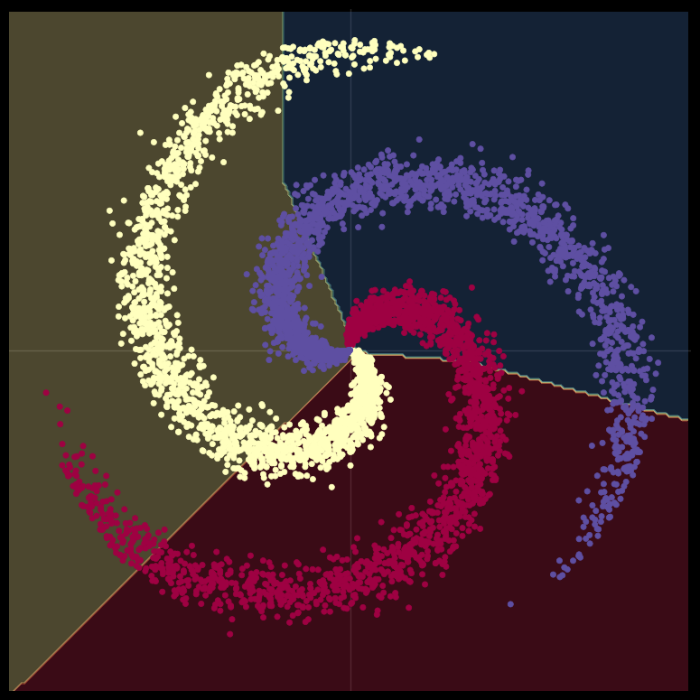


* H = 10:

  * Here we can able to see that in 10D we are able to differentiate classes well but still not perfect

  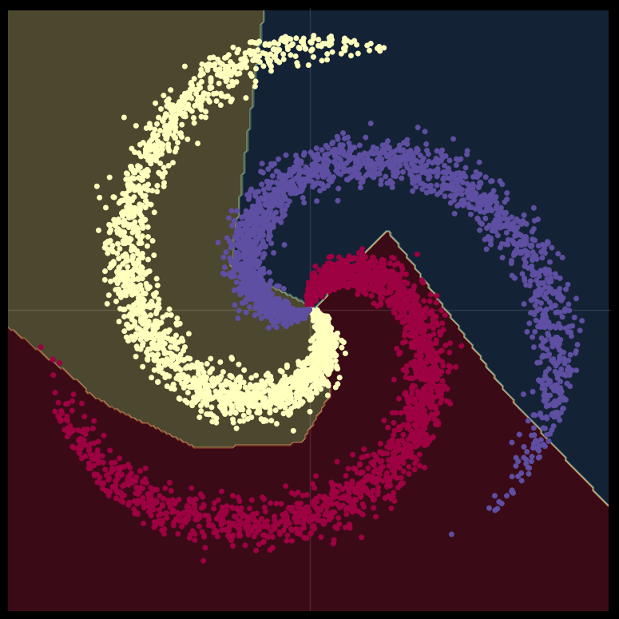

* H = 50:
  
  * Here we see that it is fine and best classifier.

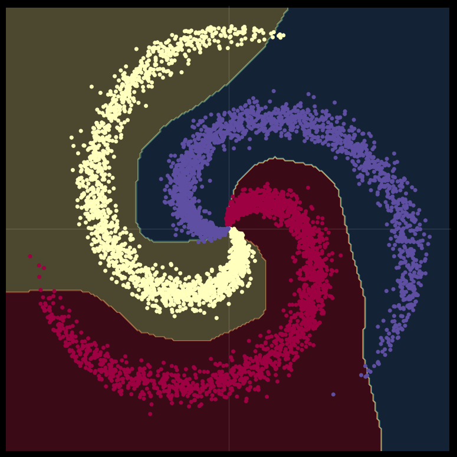

* H = 100:
  * Seems like overfitting

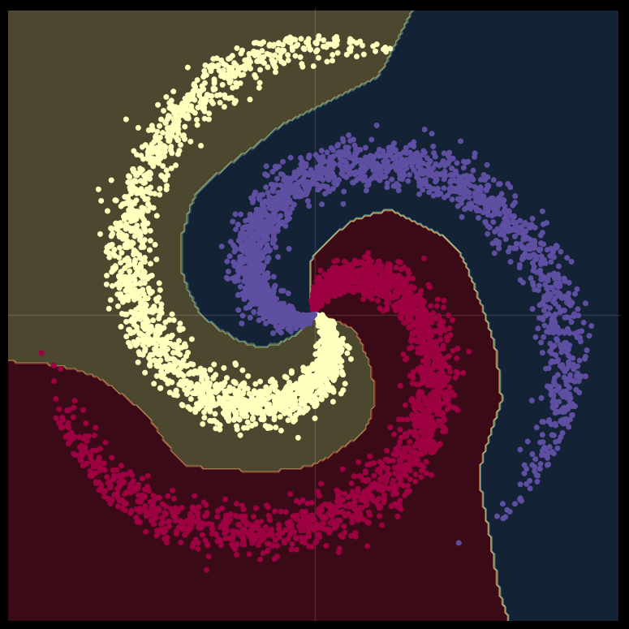


* Model with 3 layers:

  ````python
  model = nn.Sequential(
      nn.Linear(D, H1),
      nn.ReLU(),
      nn.Linear(H1, H2),
      nn.ReLU(),
      nn.Linear(H2,C)
  )
  ````

  

  

  | S.No |  H1  |  H2  |  Accuracy  |  Loss  |
  | :--: | :--: | :--: | :--------: | :----: |
  |  1   |  3   |  3   |    0.69    | 0.6029 |
  |  2   |  3   |  10  |    0.77    | 0.4707 |
  |  3   |  3   |  50  | 0.98-0.998 | 0.0639 |
  |  4   |  3   | 100  | 0.99-0.999 | 0.0487 |
  |  5   |  5   |  10  |   0.905    | 0.3024 |
  |  6   |  5   |  50  |   0.994    | 0.0308 |
  |  7   |  10  |  10  |   0.994    | 0.055  |
  |  8   |  10  |  5   |    0.97    | 0.1492 |
  |  9   |  10  |  3   |   0.909    | 0.2451 |
  |  10  |  10  |  2   |    0.90    | 0.3888 |
  |  11  |  10  |  1   |    0.54    | 0.8000 |
  |  12  |  2   |  10  |    0.70    | 0.4588 |
  |  13  |  1   |  10  |    0.45    | 0.912  |

  

Figures :

* H1 = 3,H2 = 3:
  * It is also similar(lesser sense) to 2 layer H = 10 neural net (3*3 = 9).It looks like affine transformations in 3D are giving good results.

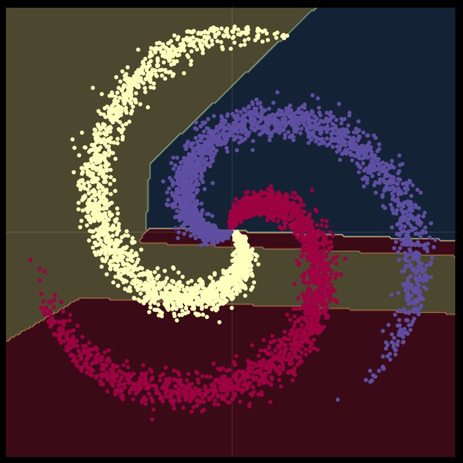

* H1 = 3,H2 = 10
  * It is like 2D->3D->10D->output
  * It is also near to H = 10 neural net(higher sense).It need more Information as above that is more D's

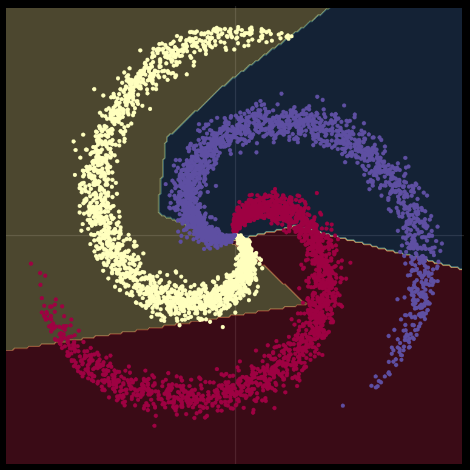

* H1 = 3, H2 = 50

  * 3D->50D
  * On avg good than 2 layer H = 50 neural net but less than 2 layer H = 100 neural net.
  * seems like perfect.

  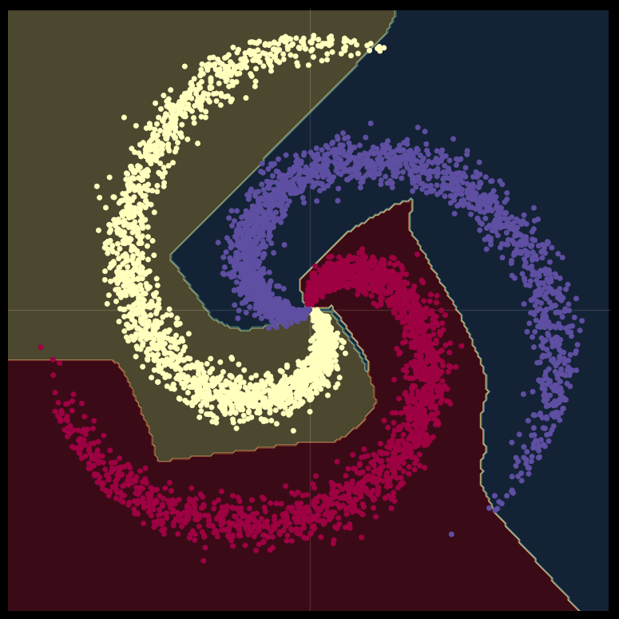

* H1 = 3, H2 = 100

  * Best,Overfits

  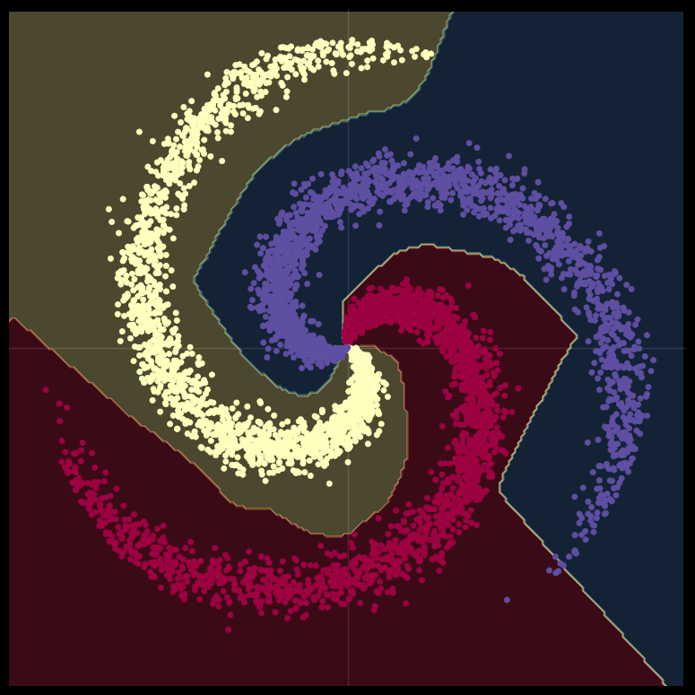

* H1 = 5,H2  = 10

  * lesser than single layer H = 50(5*10 = 50)
  * Need more curves ie., D's.

  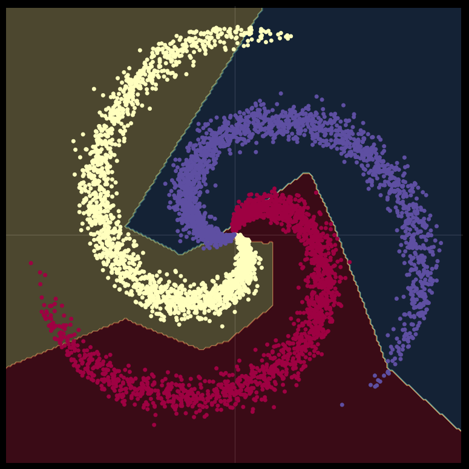

* H1 = 10,H2 = 5

  * better than above and near to  single layer H = 50(5*10 = 50)
  * It has good amount of curves than above

  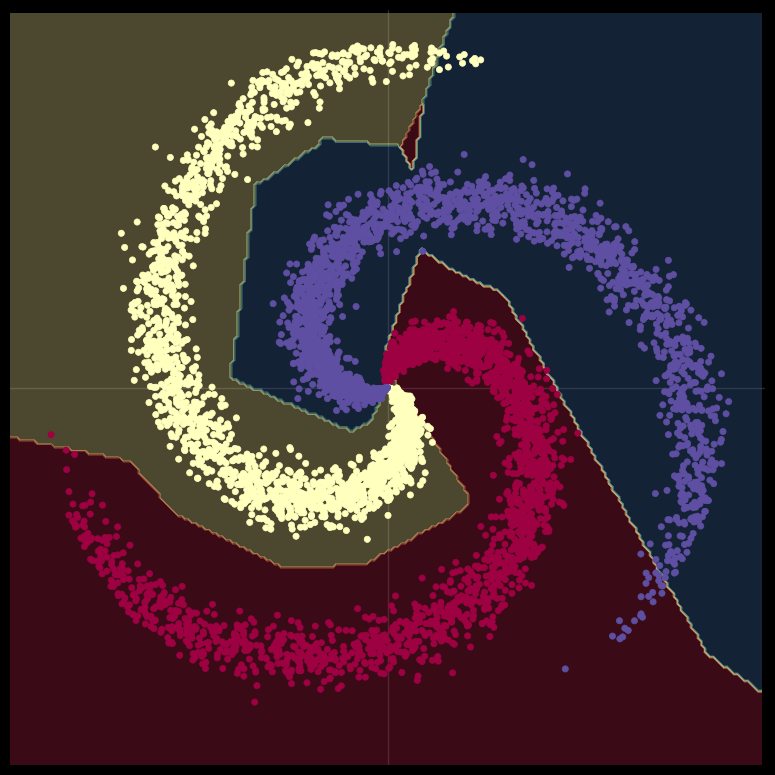

* H1 = 10, H2 = 10

  * Perfect (10*10 = 100)

  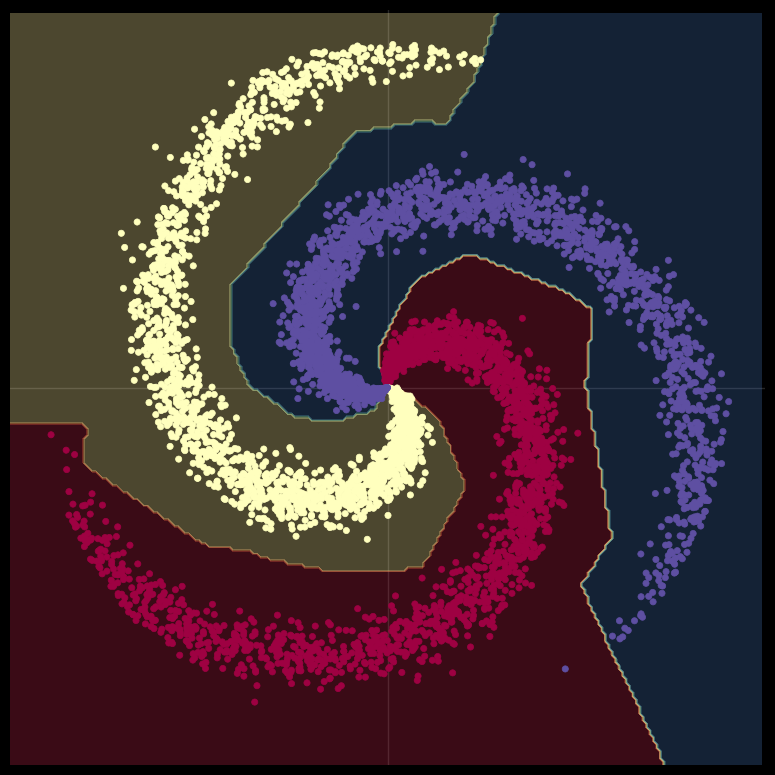

* H1 = 3, H2 = 10

  * Need curves

  

* H1 = 2,H2 = 10

  * need more information and curves

  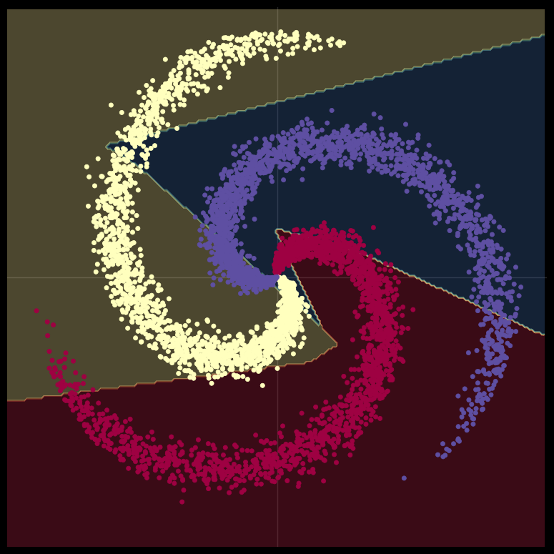

* H1 = 1,H2 = 10

  * Need more information and curves

  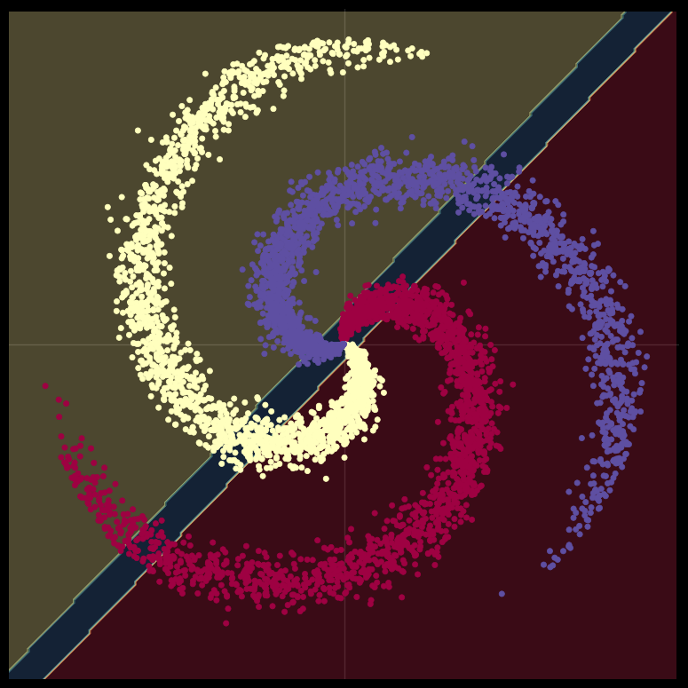

* H1 = 10,H2 = 1
  
  * Need more information and curves

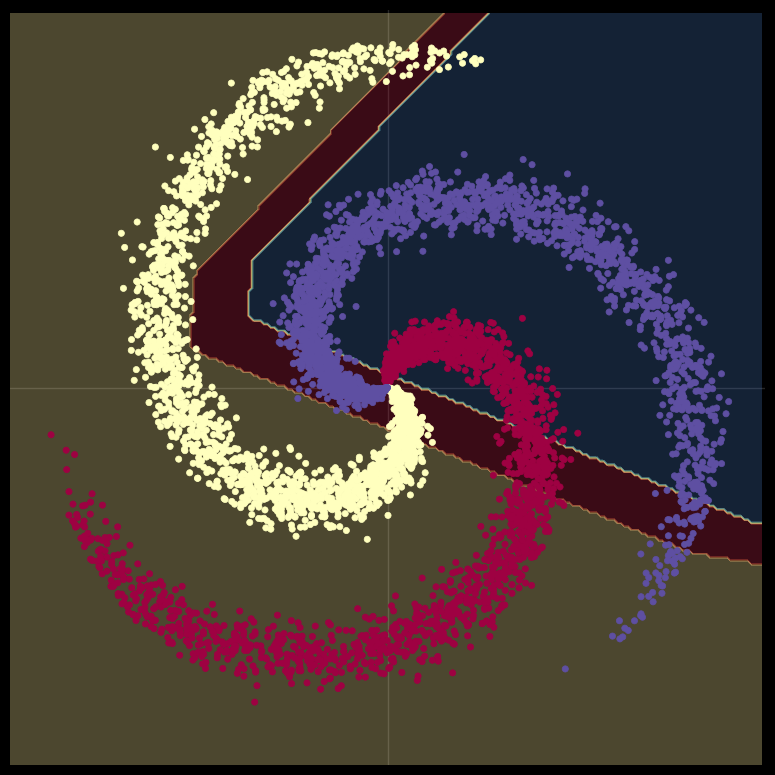

| S.No |   H   |  Accuracy  |  Loss   |
| :--: | :---: | :--------: | :-----: |
|  1   | C = 3 |  0.5-0.62  | ~0.7769 |
|  2   |  10   |  0.7-0.81  | ~0.3825 |
|  3   |  50   | 0.95-0.98  | ~0.1221 |
|  4   |  100  | 0.99-0.999 | ~0.0634 |

| S.No |  H1  |  H2  |  Accuracy  |  Loss  |
| :--: | :--: | :--: | :--------: | :----: |
|  1   |  3   |  3   |    0.69    | 0.6029 |
|  2   |  3   |  10  |    0.77    | 0.4707 |
|  3   |  3   |  50  | 0.98-0.998 | 0.0639 |
|  4   |  3   | 100  | 0.99-0.999 | 0.0487 |
|  5   |  5   |  10  |   0.905    | 0.3024 |
|  6   |  5   |  50  |   0.994    | 0.0308 |
|  7   |  10  |  10  |   0.994    | 0.055  |
|  8   |  10  |  5   |    0.97    | 0.1492 |
|  9   |  10  |  3   |   0.909    | 0.2451 |
|  10  |  10  |  2   |    0.90    | 0.3888 |
|  11  |  10  |  1   |    0.54    | 0.8000 |
|  12  |  2   |  10  |    0.70    | 0.4588 |
|  13  |  1   |  10  |    0.45    | 0.912  |

### Conclusion on How to choose network Architecture:

* 

